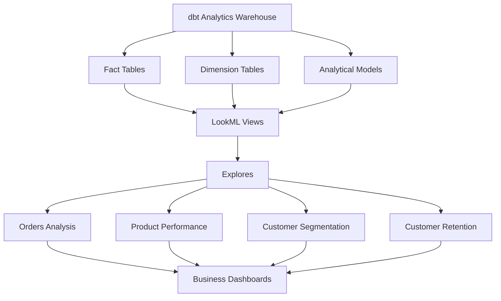
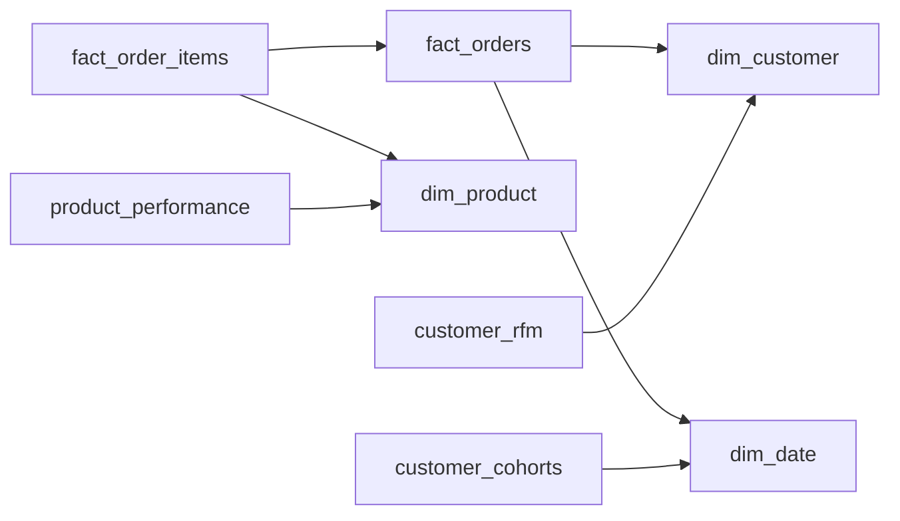

# LookML Semantic Layer

This directory contains the **LookML semantic layer** built on top of the dbt analytics warehouse.

The semantic layer defines reusable **dimensions, measures, and explores** that allow business users to analyze data without writing SQL.

LookML translates the warehouse models into **business-friendly analytics models** that can power dashboards and ad-hoc analysis.

---

# Semantic Layer Architecture



The LookML semantic layer sits between the **data warehouse and BI dashboards**, providing governed and reusable analytics definitions.

---

# LookML Project Structure

```
lookml
│
├── Models
│   └── instacart.model.lkml
│
├── Views
│   ├── dim_customer.view.lkml
│   ├── dim_product.view.lkml
│   ├── dim_date.view.lkml
│   ├── fact_orders.view.lkml
│   ├── fact_order_items.view.lkml
│   ├── product_performance.view.lkml
│   ├── customer_cohorts.view.lkml
│   └── customer_rfm.view.lkml
│
└── README.md
```

---

# Models

The **Models folder** defines the LookML model file.

The model file controls:

* Explore definitions
* View relationships
* Join logic between datasets

Example:

```
instacart.model.lkml
```

The model exposes analytics datasets to business users.

---

# Views

The **Views folder** contains LookML views mapped to warehouse tables.

Each view defines:

* Dimensions
* Measures
* Time-based fields
* Business metrics

Examples:

| View                | Description                                       |
| ------------------- | ------------------------------------------------- |
| dim_customer        | Customer attributes and lifecycle metrics         |
| dim_product         | Product attributes including aisle and department |
| dim_date            | Calendar dimension used for time-based analytics  |
| fact_orders         | Order-level metrics including revenue and margin  |
| fact_order_items    | Product-level order details                       |
| product_performance | Aggregated product revenue and margin analytics   |
| customer_rfm        | Customer segmentation using RFM metrics           |
| customer_cohorts    | Customer retention cohort analysis                |

---

# Explore Relationships

Explores define how business users query data and how views are joined together.



These relationships allow users to analyze:

* Order trends
* Product performance
* Customer behavior
* Customer retention

---

# Example Analytics Use Cases

The semantic layer supports analytics such as:

### Revenue Analytics

* Monthly revenue trends
* Average order value

### Product Analytics

* Top selling products
* Product margin analysis

### Customer Analytics

* Customer lifetime value
* Customer segmentation using RFM

### Retention Analytics

* Customer cohort retention analysis
* Repeat purchase behavior

---

# Role of LookML in This Project

LookML acts as the **semantic layer between the warehouse and business intelligence tools**, enabling:

* Consistent business metrics
* Reusable explores
* Governed data definitions
* Simplified analytics for business users

This semantic layer allows analysts and business stakeholders to explore data **without needing to write SQL queries**.
